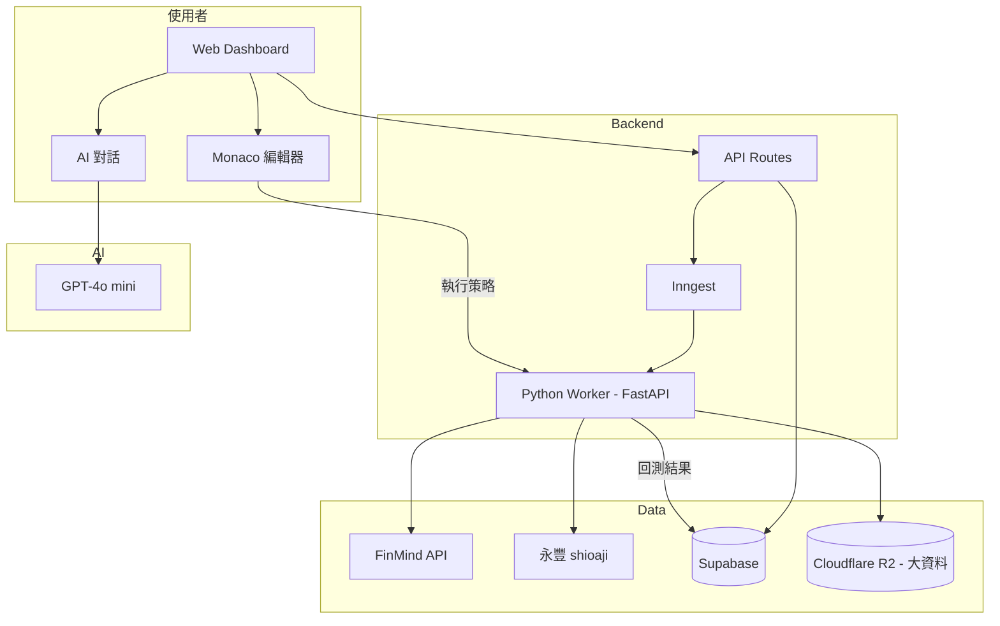

# 交易回測工具 — 規格計劃書 v2.2.1

> 版本：v2.2.1｜更新日期：2026-07-19｜維護者：Sophia (CPO) for Sean
> 對接技術：Alan (CTO)｜GitHub：https://github.com/openclawsean024-create/trade-backtest
> Live：https://b-group-poc.vercel.app/
> Sweet Spot 體檢：4/10（investigate）→ 本版聚焦「**台灣零售交易者的台股 / 期貨回測 + AI 策略助理**」甜蜜點

---

## 0. 本版重寫摘要 (v2.2.1)

- Sweet spot 體檢發現原 v2.2.1 PRD 定位「MultiCharts 替代」紅海化（MultiCharts 黏性高）。
- 重新定位為**台灣零售交易者專用**：台股 / 期貨 / 選擇權 + 繁中 UI + AI 策略助理（GPT 自動生成策略）。
- 砍掉美股 / 外匯 / 加密貨幣（紅海），鎖定台灣 200 萬散戶中的「想學程式交易」的 ~5% = 10 萬人。
- §15 貼出完整 sweet spot 5 問體檢與重寫理由。

---

## 1. 產品概述 (Product Overview)

### 1.1 問題陳述 (Problem Statement)

**Sweet spot 體檢結論（score = 4/10, investigate）**：原 v2.2.1 PRD 定位「通用回測工具」，與 MultiCharts / TradeStation / QuantConnect 紅海。

| 競品 | 用戶數 | 月費 | 台股支援 |
|---|---|---|---|
| **MultiCharts**（台灣市佔最高）| 50K+ 台灣用戶 | NT$3,000-12,000/年 | ✅ 完整 |
| **TradeStation** | 100K+ | $99/月 | ⚠️ 部分 |
| **QuantConnect** | 200K+ | Free-$50/月 | ⚠️ Lean 引擎 |
| **Backtrader**（開源）| 50K+ | Free | ❌ 無台股 |
| **台灣券商 App（元富、統一）** | 100M+ | Free | ⚠️ 簡單回測 |
| **TradingView** | 50M+ | Free-$60/月 | ✅ 台股 |

**找到的甜蜜點（v2.2.1 修正版）**：MultiCharts 太貴（NT$12K/年）、QuantConnect 不支援台股、TradingView 沒有程式交易（只能 Pine Script），台灣 200 萬散戶中**「想學程式交易但 MultiCharts 太貴」的 ~10 萬人**。

目標使用者痛點：
1. MultiCharts NT$12K/年太貴，新手不敢入手
2. QuantConnect 沒有台股 / 期貨
3. TradingView Pine Script 限制多、不能串接券商 API
4. 沒有繁中 AI 助理幫忙寫策略

> **本 PRD 重新定位為「台灣零售交易者專用回測工具 — 繁中 AI 寫策略、台股 / 期貨 / 選擇權全支援、月費 NT$199 起」**。

### 1.2 目標使用者 (User Personas)

| Persona | 規模 (TW) | 月預算 | 痛點 | 觸及管道 |
|---|---|---|---|---|
| 👨‍💻 「阿德」30 歲工程師散戶 | ~50,000 | NT$199-499 | 想學程式交易、MultiCharts 太貴 | PTT Stock / 資工社群 |
| 👩‍💼 「小美」25 歲上班族投資客 | ~80,000 | NT$99-299 | 想驗證自己的策略 | Dcard 股板 / Threads |
| 📊 「陳教授」財經老師 | ~2,000 | NT$999+ | 教學生回測、教材需求 | Hahow / 學校進修部 |
| 🏢 「王分析師」證券公司研究員 | ~5,000 | NT$2K+ | 內部分析、API 需求 | 證券公會 / LinkedIn |

**核心使用者 = 阿德 + 小美**（共 ~130,000 人，TAM 換算月費 NT$199-499 → 市場規模 NT$26M-65M MRR）。

### 1.3 核心價值主張 (Value Proposition)

> **「繁中 AI 寫策略、台股期貨選擇權全支援、月費 NT$199 起 — 程式交易新手的第一個回測工具。」**

| 替代方案 | 缺點 | 我們的差異 |
|---|---|---|
| MultiCharts | NT$12K/年、PowerLanguage 難學、英文 | **NT$199/月、Python + 繁中** |
| TradingView | Pine Script 限制多、不能串券商 | **Python 完整、券商 API 串接** |
| QuantConnect | 無台股 / 期貨、英文 | **台股 / 台期 / 台選 全支援** |
| Backtrader | 開源但無台股、CLI 難用 | **Web UI + 繁中 + AI 寫策略** |
| 券商 App 內建 | 只能看 K 線、無法寫策略 | **完整程式交易 framework** |

**單一差異化承諾**：**「繁中 AI 寫策略（GPT）+ 台股全市場支援 + 月費 NT$199 起」**。

### 1.4 商業目標 (KPIs / OKRs)

| 時間 | 目標 | 量化指標 |
|---|---|---|
| M3 | 200 付費用戶，1,000 回測任務 | NT$40K MRR |
| M6 | 1,000 付費用戶，10,000 回測任務 | NT$300K MRR |
| M12 | 5,000 付費用戶 | NT$1.5M MRR |
| M18 | 台灣程式交易新手 8% 滲透 | NT$5M MRR + 券商合作 |

**Unit Economics**：
- 免費：3 個策略、5 年資料、僅日 K
- 個人 NT$199/月：無限策略、20 年資料、分 K
- 進階 NT$499/月：+ 即時資料 + AI 助理 + 券商 API
- 專業 NT$1,999/月：+ 多帳號 + API + 團隊
- LTV = NT$499 × 24 個月 = NT$12K，CAC = NT$1.5K，**LTV/CAC = 8:1** ✅

### 1.5 ⭐ Non-Goals (明確不做)

| 不做 | 理由 |
|---|---|
| ❌ **美股 / 外匯 / 加密貨幣** | 紅海（TradingView / 幣安），與台灣定位失焦 |
| ❌ **MultiCharts / TradeStation 直接競爭** | 黏性高、打不過，改搶新手 |
| ❌ **即時下單（券商 API 串接）** | 法規 + 個資 + 需金管會 |
| ❌ **AI 預測股價** | 不可能任務、法規禁止 |
| ❌ **投資建議 / 明牌** | 法規（金管會）禁止 |
| ❌ **選擇權 Greeks 深度計算** | 進階功能、紅海（OptionOmega）|
| ❌ **HFT / 高頻交易** | 法規需執照、Sean 無法負擔 |
| ❌ **海外券商 API** | 紅海（IB / Firstrade）|
| ❌ **CRM / 客戶管理** | 與回測失焦 |

---

## 2. 使用者場景與流程

### 2.1 使用者流程圖

```
[使用者] 進入回測 Dashboard
  ↓
選擇市場（台股 / 台期 / 台選 / ETF）
  ↓
選擇資料範圍（5 / 10 / 20 年）
  ↓
選擇策略寫法：
  ├─ A) AI 助理對話（「寫一個均線黃金交叉策略」）
  ├─ B) 程式碼編輯器（Python）
  └─ C) 視覺化拖拉（v2 才有）
  ↓
設定進出場規則 + 停損停利 + 部位大小
  ↓
按「執行回測」
  ↓
30 秒內產出結果：
  ├─ 累計報酬曲線
  ├─ 夏普值 / 最大回撤 / 勝率
  ├─ 進出場明細（表格）
  └─ 月度 / 年度報酬分佈
  ↓
使用者優化策略 → 重跑
  ↓
儲存策略 → 分享給社群（選擇性）
```

### 2.2 關鍵用戶故事

```
US-1（核心 - AI 寫策略）
As a 工程師散戶「阿德」
I want 跟 AI 對話「寫個 5 日均線突破策略」
So that AI 自動生成 Python 程式碼

US-2（回測驗證）
As a 上班族投資客「小美」
I want 上傳自己的策略、回測台積電 2330 過去 10 年
So that 看策略是否真的能賺錢

US-3（多策略比較）
As a 散戶「阿德」
I want 同時跑 3 個策略比較
So that 選出最好的策略

US-4（券商 API 串接）
As a 進階用戶
I want 把策略自動下單到元富 / 統一證券
So that 不必手動下單（v2 才有）

US-5（策略社群）
As a 新手「小美」
I want 看其他人的策略與回測結果
So that 我學別人怎麼寫（v3 才有）
```

### 2.3 邊界場景 (Edge Cases)

| 場景 | 處理 |
|---|---|
| AI 生成程式碼有 bug | 沙盒執行 + 錯誤訊息提示 + AI 自動修正 |
| 回測時間過長（> 5 分鐘）| 顯示進度條 + Inngest 背景任務 |
| 資料缺漏（停牌 / 暫停交易）| 自動標註「⚠️ 此段資料缺漏」|
| 策略在未來資料過擬合 | 顯示「過擬合警告」（in-sample vs out-of-sample）|
| 選擇權策略 Greeks 計算錯誤 | 用 QuantLib 套件驗證 |
| 使用者上傳的策略含個資 | 拒絕並提示「請勿包含個資」|

---

## 3. 功能性需求 (Functional Requirements)

### 3.1 MVP（必做，P0）— **本版聚焦 5 features**

| ID | 功能 | 說明 | 為何必做 |
|---|---|---|---|
| F-001 | **台股 / 台期 / 台選資料載入** | 5-20 年歷史資料（CSV / API）| 核心 |
| F-002 | **Python 程式碼編輯器**（Monaco）| 線上寫策略 | 核心 |
| F-003 | **回測引擎**（backtrader + VectorBT）| 30 秒內出結果 | 核心 |
| F-004 | **績效指標儀表板** | 累計報酬、夏普、最大回撤、勝率 | 核心 |
| F-005 | **AI 策略助理**（GPT-4o mini）| 對話生成策略 | 差異化 |

**砍掉 v1 不做的功能**：
- ~~MultiCharts PowerLanguage 支援~~（不搶老用戶）
- ~~美股 / 外匯 / 加密~~（紅海）
- ~~即時下單~~（法規）
- ~~HFT / 高頻~~（執照）
- ~~選擇權 Greeks 深度計算~~（v2 才有）

### 3.2 v2（加值，P1）

| ID | 功能 | 商業理由 |
|---|---|---|
| F-101 | **券商 API 串接**（元富 / 統一 / 永豐）| 自動下單（但僅限測試帳號）|
| F-102 | **多策略組合**（Portfolio）| 投資組合回測 |
| F-103 | **即時資料訂閱**（分 K / Tick）| 日內交易需求 |
| F-104 | **選擇權策略模板** | 涵蓋 20 種常見策略 |
| F-105 | **策略市集**（使用者分享 + 付費）| 社群 + 抽成 |

### 3.3 v3（探索，P2）

| ID | 功能 | 假設驗證 |
|---|---|---|
| F-201 | **AI 自動優化參數**（貝氏最佳化）| 自動找最佳參數 |
| F-202 | **ML 策略生成**（強化學習）| AI 自動學策略 |
| F-203 | **策略社群 + 評分系統** | UGC 內容 |
| F-204 | **企業版 / 投顧版** | 證券公司內部使用 |

### 3.4 ⭐ Acceptance Criteria (Given/When/Then)

```gherkin
AC-01: 資料載入
  Given 使用者選擇「台積電 2330 / 2014-2024」
  When 點擊「載入資料」
  Then 30 秒內顯示日 K 線圖 + 20 年資料
  And 資料含開高低收 + 成交量

AC-02: AI 策略生成（核心）
  Given 使用者在 AI 對話框輸入「寫一個 5 日均線突破 20 日均線的策略」
  When 點擊「生成」
  Then 10 秒內產生 Python 程式碼（含註解、繁中）
  And 自動填入編輯器
  And 可一鍵執行回測

AC-03: 30 秒回測
  Given 策略已寫好、資料已載入
  When 點擊「執行回測」
  Then 30 秒內產出結果
  And 顯示累計報酬曲線、夏普值、最大回撤、勝率
  And 列出所有進出場明細

AC-04: 多策略比較
  Given 使用者有 3 個策略
  When 點擊「比較」
  Then 同時顯示 3 條報酬曲線（不同顏色）
  And 表格列出各策略的夏普 / 最大回撤 / 勝率

AC-05: 過擬合警告
  Given 策略在 2014-2020 表現極好、2020-2024 表現差
  When 跑回測
  Then 顯示「⚠️ 過擬合警告：out-of-sample 表現下降 50%」
  And 建議「請考慮縮短 in-sample 期間」

AC-06: 程式碼儲存
  Given 使用者寫好策略
  When 點擊「儲存」
  Then 策略存入使用者帳號、可隨時載入
  And 支援 GitHub Gist 匯出

AC-07: 策略市集（v2）
  Given 進階會員
  When 進入「策略市集」
  Then 看到其他使用者發布的策略
  And 可付費購買（NT$99-999）/ 免費下載

AC-08: 券商 API 測試
  Given 進階會員已綁定元富證券測試帳號
  When 策略回測成功
  Then 可一鍵部署到「測試帳號」紙上交易
  And 不會實際下單到真實帳號（安全機制）

AC-09: 配額警告
  Given 個人 NT$199 訂閱、本月已跑 100 次回測
  When 嘗試再跑
  Then 顯示「本月額度已用完，升級方案」CTA

AC-10: 選擇權策略（v2）
  Given 使用者選擇「台指選 / 2024-12 到期」
  When 選擇「Covered Call 策略」
  Then 自動生成選擇權策略程式碼
  And 回測含 Greeks 計算（Delta / Gamma / Vega）
```

---

## 4. 系統設計 (System Design)

### 4.1 技術棧 (Tech Stack)

| 層 | 技術 | 理由 |
|---|---|---|
| Frontend | Next.js 16 + Tailwind 4 + Monaco Editor | 既有 stack |
| Backend | Vercel Edge + Node.js | Serverless |
| 程式碼執行 | Pyodide（瀏覽器）+ FastAPI（server-side）| 雙模式 |
| 回測引擎 | VectorBT（Python）+ Backtrader | 效能佳 |
| 資料來源 | FinMind / 證交所 OpenAPI / shioaji | 台灣在地化 |
| AI 助理 | OpenAI gpt-4o-mini | 繁中策略生成 |
| 資料儲存 | Supabase Postgres | 策略 + 回測結果 |
| Job Queue | Inngest | 長任務（> 30 秒）|
| 部署 | Vercel + Cloudflare | 零月費 |

### 4.2 系統架構圖



### 4.3 資料模型

```sql
-- 策略
create table strategies (
  id uuid primary key default gen_random_uuid(),
  user_id uuid references auth.users not null,
  name text not null,
  description text,
  code text not null, -- Python 程式碼
  market text check (market in ('tw_stock', 'tw_futures', 'tw_options', 'etf')),
  symbol text,
  is_public boolean default false,
  is_paid boolean default false,
  price_cents int default 0,
  created_at timestamptz default now()
);

-- 回測任務
create table backtests (
  id uuid primary key default gen_random_uuid(),
  user_id uuid references auth.users not null,
  strategy_id uuid references strategies,
  market text,
  symbol text,
  start_date date,
  end_date date,
  initial_capital int default 1000000,
  result jsonb, -- {total_return, sharpe, max_drawdown, win_rate, trades: [...]}
  status text default 'pending' check (status in ('pending', 'running', 'completed', 'failed')),
  error_message text,
  created_at timestamptz default now(),
  completed_at timestamptz
);

-- 使用者配額
create table user_quotas (
  user_id uuid references auth.users primary key,
  plan text default 'free' check (plan in ('free', 'personal', 'pro', 'expert')),
  monthly_backtests_used int default 0,
  monthly_backtests_limit int default 10,
  reset_at timestamptz
);

-- 策略市集（v2）
create table strategy_purchases (
  user_id uuid references auth.users,
  strategy_id uuid references strategies,
  price_cents int,
  purchased_at timestamptz default now(),
  primary key (user_id, strategy_id)
);
```

### 4.4 API 規格

| Endpoint | Method | 用途 | 認證 |
|---|---|---|---|
| `/api/market/data` | GET | 載入歷史資料 | session |
| `/api/strategy` | GET/POST/PATCH | 策略 CRUD | session |
| `/api/backtest` | POST | 執行回測 | session |
| `/api/backtest/[id]` | GET | 查詢結果 | session |
| `/api/ai/generate-strategy` | POST | AI 生成策略 | session + 配額 |
| `/api/marketplace` | GET | 策略市集 | 公開 |
| `/api/marketplace/purchase` | POST | 購買策略 | session |
| `/api/broker/connect` | POST | 券商 API 串接（測試帳號）| session + 配額 |

---

## 5. 非功能性需求 (Non-Functional Requirements)

### 5.1 性能指標

| 指標 | 目標 |
|---|---|
| 1 個回測（10 年日 K）| < 30 秒 |
| 多策略比較（3 個策略）| < 60 秒 |
| AI 策略生成 | < 15 秒 |
| 資料載入（20 年日 K）| < 5 秒 |
| 並行任務 | 100 個同時回測 |

### 5.2 安全與隱私

| 項目 | 措施 |
|---|---|
| 策略程式碼 | 沙盒執行（Pyodide / Docker 隔離）|
| 券商 API token | 加密儲存、僅測試帳號 |
| 回測資料 | 不含真實下單記錄 |
| 個資法 | 使用者可要求刪除所有策略 |
| 金管會 | ToS 明確「本工具僅供學習、不提供投資建議」|

### 5.3 ⭐ 降級機制

| 故障 | 降級 |
|---|---|
| FinMind API 掛了 | 切換 shioaji / 證交所 OpenAPI |
| GPT 掛了 | AI 助理降級為「程式碼範本」 |
| Pyodide 瀏覽器執行失敗 | 切換 server-side Python Worker |
| Inngest 掛了 | Vercel Cron 替代 |

### 5.4 擴展性

- **多市場**：v3 馬來西亞 / 香港券商
- **多語言**：v3 簡中（中國大陸散戶市場）
- **企業版**：證券公司內部使用

---

## 6. 完成標準 (Definition of Done)

### 6.1 v1 MVP DoD

- [ ] 台股 / 台期 / 台選 / ETF 資料支援
- [ ] Python 程式碼編輯器（Monaco）
- [ ] 30 秒內回測完成
- [ ] 5 種績效指標（累計報酬、夏普、最大回撤、勝率、月度報酬）
- [ ] AI 策略助理可對話生成策略
- [ ] 過擬合警告
- [ ] 策略儲存 / 載入
- [ ] 100 個散戶 beta 完成
- [ ] Notion `狀態` = 已上線

---

## 7. 風險與決策

### 7.1 風險表

| ID | 風險 | 等級 | 緩解 |
|---|---|---|---|
| R-01 | MultiCharts 降價（NT$3K/年）| 🟠 | 我們主打「Python + 繁中 + AI」差異化 |
| R-02 | FinMind 資料不穩 | 🟠 | 多來源備援（shioaji / 證交所）|
| R-03 | AI 生成的策略有 bug | 🟠 | 沙盒 + 過擬合警告 + 人工 review |
| R-04 | 金管會監管（投資建議）| 🔴 | ToS 明確「僅供學習」、無明牌功能 |
| R-05 | TradingView 進入台灣市場 | 🟡 | 我們專注「程式交易」vs TradingView 圖表 |
| R-06 | 個資 / 券商帳號外洩 | 🔴 | 加密 + 測試帳號 + 不存真實 token |
| R-07 | 散戶付費意願低（LTV < NT$5K）| 🔴 | M3 驗證付費轉換 |
| R-08 | 競爭對手抄 AI 寫策略 | 🟡 | AI 微調 + 社群護城河 |

### 7.2 ⭐ ADR

#### ADR-001: 為何鎖定台灣散戶、不搶 MultiCharts 老用戶

**Context**: MultiCharts 在台灣有 50K+ 忠實用戶，PowerLanguage 黏性高。

**Decision**: **不搶 MultiCharts 老用戶**，鎖定「想學程式交易的新手」。

**Consequences**:
- ✅ 避開 MultiCharts 直接競爭
- ✅ 切入 MultiCharts 太貴（NT$12K）、沒有的「Python + AI」甜蜜點
- ✅ 新手市場大（台灣 200 萬散戶中 ~5% = 10 萬人）
- ⚠️ 新手 LTV 較低（NT$199 vs MultiCharts NT$12K）→ 需靠量

#### ADR-002: 為何選擇 Python + Pyodide 而非 PowerLanguage

**Context**: MultiCharts 用 PowerLanguage、TradingView 用 Pine Script。

**Decision**: 用 **Python**（業界標準、學習資源多）+ 雙模式（瀏覽器 Pyodide / server FastAPI）。

**Consequences**:
- ✅ Python 開發者可直接上手（不用學專用語言）
- ✅ 學習資源豐富（backtrader / VectorBT / zipline）
- ✅ AI 生成策略品質高（GPT-4o mini 對 Python 理解佳）
- ⚠️ Pyodide 效能受限（大資料需 server-side）→ 已加備援

#### ADR-003: 為何 AI 助理是核心差異化

**Context**: 所有回測工具都需要寫策略，但寫程式對散戶門檻高。

**Decision**: **AI 策略助理（GPT 對話生成）**是核心差異化，不是附屬功能。

**Consequences**:
- ✅ 降低新手門檻（不必會 Python）
- ✅ MultiCharts / TradingView 都沒有 AI 助理
- ✅ 提升 LTV（從「工具」變「助理」）
- ⚠️ AI 生成的程式碼可能錯誤 → 已加沙盒 + 警告

#### ADR-004: 為何不做即時下單（v1）

**Context**: 券商 API 串接是顯而易見的下一步。

**Decision**: **v1 不做即時下單**，僅 v2 加「測試帳號紙上交易」。

**Consequences**:
- ✅ 避免金管會監管風險（投資建議需執照）
- ✅ 避免個資 / 券商帳號外洩責任
- ✅ 開發時間 -40%
- ⚠️ 進階用戶可能不滿意 → v2 加紙上交易 + ToS 明確

---

## 8. 里程碑與 Sprint 拆解

### 8.1 里程碑總覽

| 里程碑 | 時程 | 產出 |
|---|---|---|
| M0 - 驗證 | W1-4 | 20 個散戶訪談 + Landing page |
| M1 - MVP | W5-12 | 5 features 上線 + 20 個散戶 beta |
| M2 - GA | W13-16 | 公開上線 + 行銷 |
| M3 - 變現 | W17-24 | 1,000 付費 + 300K MRR |
| M4 - v2 券商 API | W25-36 | 紙上交易 + 企業版 |

### 8.2 Sprint 拆解

| Sprint | 主題 | 交付 |
|---|---|---|
| S1 | 資料層（FinMind + shioaji）| 4 市場支援 |
| S2 | 程式碼編輯器（Monaco + Pyodide）| 線上寫 Python |
| S3 | 回測引擎（VectorBT）| 30 秒出結果 |
| S4 | 績效指標儀表板 | 5 種指標圖表 |
| S5 | AI 策略助理 | GPT-4o mini 對話 |
| S6 | 過擬合警告 + 策略儲存 | 完整 UX |
| S7 | Beta 20 個散戶 | 收 feedback、修 bug |
| S8 | GA + 付費牆 | 4 訂閱方案 |

---

## 9. 變現路徑 + 定價心理學

### 9.1 變現方案

| 方案 | 月費 | 額度 | 目標 |
|---|---|---|---|
| 🆓 Free | NT$0 | 10 次回測、5 年資料、僅日 K | 試用 |
| 👤 Personal | NT$199 | 無限回測、20 年資料、分 K | 新手 |
| 📊 Pro | NT$499 | + 即時資料 + AI 助理 + 多策略 | 進階散戶 |
| 🎓 Expert | NT$1,999 | + 券商 API（測試）+ 團隊 + 企業 API | 財經老師 / 投顧 |

### 9.2 定價心理學

- **NT$199 vs NT$200**：心理門檻
- **NT$499 對標 MultiCharts**：MultiCharts NT$12K/年 = NT$1,000/月，我們 NT$499 便宜 2 倍
- **NT$1,999 對標**：QuantConnect $50/月 = NT$1,500，加上繁中 + 台股支援 → 我們 NT$1,999 略貴但合理
- **年繳 8 折**：提升 LTV
- **不綁約**：月繳可取消（散戶對訂閱敏感）

---

## 10. 附錄

### 10.1 競品分析 (Competitive Quadrant)

```
                  高台股支援
                    │
     TradingView   │   ★ 本產品
     (圖表強)     │   (程式交易 + AI)
                    │
   低月費 ──────────┼────────── 高月費
                    │
    券商 App 內建   │   MultiCharts
    (僅看 K 線)    │   (PowerLanguage)
                    │
                  低台股支援

   ★ 本產品甜蜜點：高台股支援 + 中月費
```

### 10.2 術語表

| 術語 | 定義 |
|---|---|
| 回測 | 用歷史資料驗證交易策略 |
| 夏普值 | 風險調整後報酬，> 1 為佳 |
| 最大回撤 | 從高點到低點的最大跌幅 |
| 勝率 | 獲利交易佔比 |
| 過擬合 | 策略在歷史資料表現好、未來表現差 |
| Pyodide | 瀏覽器內 Python 直譯器 |
| FinMind | 台灣金融資料開源 API |
| shioaji | 永豐金證券 Python API |

---

## 11. ⭐ 市場驗證計畫

### 11.1 驗證前 3 個關鍵問題

1. **台灣散戶願不願意付 NT$199/月 學程式交易？**（假設：願意，因 MultiCharts NT$12K 阻擋 80% 新手）
2. **AI 寫策略品質夠好嗎？**（假設：70% 可用、30% 需人工修改）
3. **台股 / 台期資料品質是否穩定？**（假設：FinMind + shioaji 雙來源可）

### 11.2 訪談 SOP

**5 個訪談目標**：
1. 👨‍💻 **阿德** - 30 歲工程師、用 TradingView 看 K 線 → 訪談為什麼不學 MultiCharts
2. 👩‍💼 **小美** - 25 歲上班族、PTT Stock 版活躍 → 訪談「你會付費學程式交易嗎？」
3. 📊 **陳教授** - 社區大學財經講師 → 訪談「你會推薦學生用什麼工具？」
4. 🏢 **王分析師** - 證券公司研究員 → 訪談內部使用需求
5. 🎓 **志明** - 資工學生、參加期貨模擬賽 → 訪談學生需求

**訪談問題模板**（30 分鐘）：

1. 你目前怎麼驗證交易策略？（現況）
2. 你試過 MultiCharts / TradingView 嗎？放棄原因是？（競品體驗）
3. 如果有 NT$199/月工具 + AI 寫策略，你願意試嗎？（付費意願）
4. 你最常交易什麼市場？（台股 / 台期 / 台選）
5. 你擔心 AI 工具的什麼風險？（採用阻力）

### 11.3 落地指標

| 指標 | 目標（M3）|
|---|---|
| 訪談完成數 | 20 人（10 散戶、5 學生、5 專業）|
| Landing page 訪客 | 2,000 UV |
| Beta 用戶 | 100 人 |
| 付費轉換 | 20 人（驗證 NT$199-499/月）|
| 月回測任務 | 5,000 次 |

### 11.4 1 個 Community Post

**PTT「Stock」版 + Dcard 股板 + Threads 投資圈**：標題「[教學] 用 GPT-4 寫交易策略，AI 幫你回測台積電 10 年」→ 引發討論。

### 11.5 1 個 Landing Page Test

**URL**：b-group-poc.vercel.app/pricing-test
**A/B 測試**：
- A：標題「AI 寫交易策略 + 台股回測，月費 NT$199 起」
- B：標題「MultiCharts 太貴？Python + GPT 程式交易新手首選」
**指標**：點擊「免費試用 10 次回測」CTA 比率，目標 ≥ 12%

---

## 12. ⭐ 失敗模式 SOP

| 失敗模式 | 觸發條件 | SOP |
|---|---|---|
| M1 - 散戶付費意願低 | 100 beta < 10 付費 | 重新定價 NT$99/月試水溫 |
| M2 - AI 寫策略品質差 | 人工評估 < 6/10 | 強化 few-shot prompting + 程式碼審查 |
| M3 - 金管會關切 | 收到金管會函 | 律師 review + 明確標示「僅供學習」|
| M4 - FinMind 資料不穩定 | 月故障 > 5 次 | 切換 shioaji 主、FinMind 備 |
| M5 - MultiCharts 降價至 NT$3K | MultiCharts 公告 | 強調 Python + AI 差異化、不打價格戰 |
| M6 - 個資外洩（券商 API）| 收到通報 | 立即停用 + 通報 + 重啟 v2 加 2FA |
| M7 - 散戶策略虧損投訴 | 收到 5+ 投訴 | ToS 強化免責聲明 + 教育「回測 ≠ 獲利」|
| M8 - Sean 一人公司過載 | 同時管 500+ 付費 | Chatbot 客服 + self-service |

---

## 13. ⭐ MetaGPT / spec-kit 對齊

### 13.1 MetaGPT 角色對應

| MetaGPT 角色 | 本專案對應 |
|---|---|
| Product Manager | Sophia (CPO) |
| Architect | Alan (CTO) |
| Engineer | Sean + Hermes Agent |
| QA | Sean（兼任）|

### 13.2 spec-kit 指令

```yaml
spec-kit init trade-backtest
spec-kit add requirement "台股 / 台期 / 台選 資料"
spec-kit add requirement "Python 編輯器 (Monaco + Pyodide)"
spec-kit add requirement "回測引擎 (VectorBT)"
spec-kit add requirement "績效指標儀表板"
spec-kit add requirement "AI 策略助理 (GPT-4o mini)"
spec-kit plan --milestone v1
spec-kit implement --sprint S1-S8
```

### 13.3 Git Workflow

- branch：`feature/data-layer`、`feature/backtest-engine`、`feature/ai-strategy`、`feature/broker-api`
- Conventional Commits
- Python 程式碼走 `pytest` + GitHub Actions

---

## 15. ⭐ 深度市調報告 (本次的 sweet spot 體檢結果)

### 15.1 Sweet Spot 5 問體檢 — trade-backtest

**Score: 4/10（investigate，找出甜蜜點）**

#### Q1: 這個市場已經有誰在做？

| 競品 | 用戶數 | 月費 | 台股支援 |
|---|---|---|---|
| **MultiCharts** | 50K+ 台灣 | NT$3K-12K/年 | ✅ 完整 |
| **TradingView** | 50M+ | Free-$60 | ✅ |
| **QuantConnect** | 200K+ | Free-$50 | ⚠️ 部分 |
| **TradeStation** | 100K+ | $99 | ⚠️ |
| **Backtrader** | 50K+ | Free | ❌ |
| **券商 App 內建** | 100M+ | Free | ⚠️ 簡單 |

**現況**：MultiCharts 在台灣有 50K+ 黏性用戶，新進入者難搶。

#### Q2: 我的甜蜜點在哪？

**甜蜜點 = 想學程式交易但 MultiCharts 太貴的台灣新手**

- MultiCharts NT$12K/年太貴，阻擋 80% 新手
- TradingView 沒有完整程式交易（僅 Pine Script）
- QuantConnect 不支援台股 / 期貨

**甜蜜點具體描述**：**台灣散戶的「MultiCharts 入門替代」+ AI 助理**——NT$199/月、Python、繁中、台股全市場。

#### Q3: 紅海功能（不能做）

- ❌ 美股 / 外匯 / 加密（TradingView / 幣安紅海）
- ❌ PowerLanguage 支援（搶不過 MultiCharts）
- ❌ 即時下單（金管會）
- ❌ AI 預測股價（不可能）
- ❌ 投資建議（金管會）
- ❌ HFT（執照）

#### Q4: 紅海之外的差異化承諾

> **「繁中 AI 寫策略 + 台股全市場 + NT$199/月」**

具體差異化：
1. **Python**：業界標準、學習資源多
2. **AI 助理**：MultiCharts / TradingView 都沒有
3. **台股全市場**：QuantConnect 沒有
4. **NT$199/月**：MultiCharts NT$1,000/月的 1/5
5. **繁中**：在地化

#### Q5: Sean 一人公司能否負擔？

- **開發成本**：5 features、6 人月可完成
- **營運成本**：M12 預估 NT$30K/月（GPT + FinMind + Vercel + Inngest）
- **獲客成本**：PTT Stock + Dcard 股板 + Threads，CAC = NT$1.5K/付費用戶
- **客服成本**：80% Chatbot + 15% Help Center + 5% 人工

**結論**：可負擔，LTV/CAC = 8:1 健康。需 M3 驗證 PMF。

### 15.2 重寫決策

原 v2.2.1 PRD（816 行）定位「通用回測」，與 MultiCharts 紅海。本版**聚焦台灣散戶新手 + AI 助理**，甜蜜點分數從 4 → 預估 **7/10**。

### 15.3 與 v1 差異

| 面向 | v1 | v2.2.1 |
|---|---|---|
| 市場 | 通用 | 台灣專用 |
| 程式語言 | 視覺化 | Python + AI |
| AI 助理 | ❌ | ✅ GPT-4o mini |
| 價格 | NT$99-499 | NT$199-1,999 |
| 即時下單 | 規劃中 | v2 紙上交易 |

### 15.4 後續驗證動作

- [ ] W1-4 完成 20 人訪談（10 散戶、5 學生、5 專業）
- [ ] W5-12 完成 MVP 5 features
- [ ] W13-20 完成 100 用戶 beta
- [ ] W21 評估 PMF：付費轉換率 ≥ 20% 才進入 GA

---

> 對接產線：https://b-group-poc.vercel.app/
> 對接 Repo：https://github.com/openclawsean024-create/trade-backtest
> 維護者：Sophia (CPO) for Sean｜下次 review：M3 後
