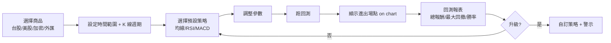
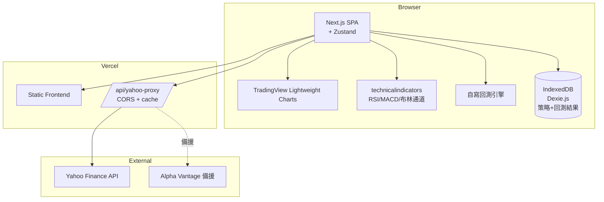
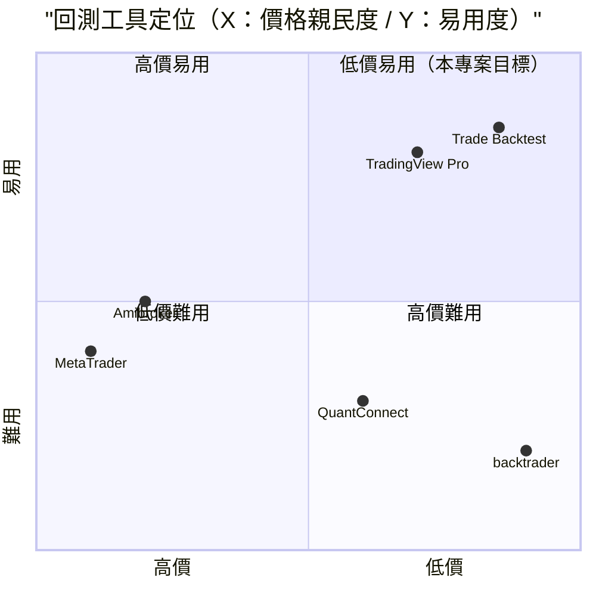

# 交易回測工具 — 規格計劃書 v2.2.1

> 版本：v2.2.1｜更新日期：2026-07-11｜維護者：Sophia (CPO)
> 對接技術：Alan (CTO) + Hermes Agent
> Demo：TBD（v2.2.1 規格階段，待 Sprint 1 部署）
> 原始碼：https://github.com/openclawsean024-create/trade-backtest

---

## 1. 產品概述 (Product Overview)

### 1.1 問題陳述 (Problem Statement)

台灣個人投資者與主觀交易者面臨三大回測痛點：

1. **商用回測平台昂貴且複雜**：MetaTrader / Amibroker 年費 US$1,000-3,000，學習曲線 6+ 月
2. **自寫 Python + backtrader/zipline**：需要工程師技能、執行環境複雜
3. **Excel 回測**：限制多（資料量/公式複雜度/即時資料難）

**目標使用者需求**：
- 主觀交易者（技術分析派）：驗證自己的交易策略但無程式能力
- 程式交易新手：想入門但商用平台過於複雜
- 投資教學者：需要示範工具給學生看
- 個人投資人：想知道某策略過去表現

### 1.2 目標使用者 (User Personas)

| Persona | 規模 | 核心痛點 | 願付價格 |
|---|---|---|---|
| **主觀交易者（技術分析派，小凱）** | 10 萬 | 想驗證策略但無程式能力 | NT$299/月 |
| **程式交易新手（小陳）** | 5 萬 | 想入門但商用平台複雜 | NT$199/月 |
| **投資教學者（Lisa）** | 2,000 | 需要示範工具給學生看 | NT$1,499/月 |
| **個人投資人（小芳）** | 30 萬 | 想驗證策略、不想學 Python | NT$0 / NT$99/月 |

### 1.3 核心價值主張 (Value Proposition)

> 「**用最少的設定，看最真的回測結果** — TradingView Lightweight Charts + Yahoo Finance 真實歷史資料 + 5 種預設策略 + 視覺化進出場點，零月費零帳號。」

**三大差異化**：
1. **零月費零帳號**：不需信用卡、不需註冊，直接體驗
2. **5 種預設策略**：均線交叉/RSI/MACD/布林通道/突破 — 一鍵套用
3. **完整回測報表**：總報酬 / 最大回撤 / 勝率 / 夏普值 / 交易明細

### 1.4 商業目標 (KPIs / OKRs)

| 時間 | KPI | 目標值 |
|---|---|---|
| **3 個月** | MAU | 5,000 |
| **6 個月** | 付費轉化率 | 4%（200 付費） |
| **6 個月** | MRR | NT$80,000 |
| **12 個月** | MRR | NT$300,000 |
| **12 個月** | 月回測次數 | 50 萬次 |

### 1.5 Non-Goals (明確不做)

- ❌ **不做即時交易** — 純回測工具，非交易平台
- ❌ **不串接券商下單** — 法規複雜（台灣有券商 API 但需 KYC）
- ❌ **不做 AI 自動選股** — 法規不允許「自動推薦」涉及投顧
- ❌ **不做多帳號管理** — v2 教學版再加
- ❌ **不支援選擇權/期貨** — v3+ 評估（資料複雜度高）
- ❌ **不做 real-time 即時資料** — Yahoo Finance API 有 15 分鐘延遲

---

## 2. 使用者場景與流程

### 2.1 使用者流程圖



### 2.2 關鍵用戶故事 (User Stories)

**US-001：選擇商品 + K 線週期**
> As a 主觀交易者  
> I want to 選擇台積電 (2330.TW) + 日 K + 2020-2025 時間範圍  
> So that 系統抓取真實歷史資料顯示在 TradingView Lightweight Charts

**US-002：選擇預設策略**
> As a 程式交易新手  
> I want to 選擇「均線交叉」策略（5日/20日均線）一鍵套用  
> So that 我不用寫程式也能測試黃金交叉策略

**US-003：跑回測 + 顯示進出場點**
> As a 個人投資人  
> I want to 看到均線交叉的進出場點標示在 K 線圖上 + 持倉時間  
> So that 我能視覺化驗證策略

**US-004：完整回測報表**
> As a 主觀交易者  
> I want to 看見總報酬 / 年化報酬 / 最大回撤 / 勝率 / 夏普值 / 平均持有天數  
> So that 我能判斷策略是否值得實盤

**US-005：自訂策略**
> As a 進階使用者  
> I want to 自訂策略（組合多個指標 + 設定停損/停利）  
> So that 我能測試複雜策略

**US-006：警示通知（升級）**
> As a 主觀交易者  
> I want to 當均線交叉時收到 LINE 通知  
> So that 我不用盯盤

### 2.3 邊界場景 (Edge Cases)

- **資料不足**：商品歷史 < 1 年，UI 警告「資料有限，僅供參考」
- **Yahoo Finance API 變動**：切換備援資料源（Alpha Vantage / FRED）
- **K 線無資料**：週末/假日自動跳過
- **回測超時**：>10 秒自動分段顯示

---

## 3. 功能性需求 (Functional Requirements)

### 3.1 MVP（必做，P0）

- [ ] **F-001 商品選擇**（Given 商品清單，When 選擇台股/美股/加密/外匯，Then 顯示商品自動完成）
- [ ] **F-002 時間範圍 + K 線週期**（Given 已選商品，When 選 1y/3y/5y/all + 日/週/月 K，Then 抓對應歷史資料）
- [ ] **F-003 5 種預設策略**（均線交叉 / RSI / MACD / 布林通道 / 突破，含可調參數）
- [ ] **F-004 跑回測**（Given 策略，When 點擊「執行回測」，Then ≤10 秒顯示結果 + 進出場點）
- [ ] **F-005 K 線圖顯示**（TradingView Lightweight Charts，含指標線 + 進出場標記）
- [ ] **F-006 完整回測報表**（總報酬 / 年化 / 最大回撤 / 勝率 / 夏普值 / 交易筆數 / 平均持有天數）
- [ ] **F-007 交易明細列表**（每筆進出場：日期/價格/類型/持有天數/損益）
- [ ] **F-008 損益曲線圖**（累計報酬隨時間變化）
- [ ] **F-009 JSON 匯出匯入**（策略 + 回測結果備份）
- [ ] **F-010 RWD 三斷點**（375/768/1440px 三斷點正常使用）

### 3.2 v2.0 教學版（加值，P1）

- [ ] **F-011 自訂策略**（組合多個指標 + 設定停損/停利）
- [ ] **F-012 LINE 警示通知**（均線交叉即時通知）
- [ ] **F-013 多帳號管理**（投資教學者管理 50 學生）
- [ ] **F-014 策略市集**（使用者上架/購買策略模板）
- [ ] **F-015 多商品組合回測**（組合投資組合 backtest）
- [ ] **F-016 API 配額**（教學版提供更多回測次數）

### 3.3 v3.0（願景，P2）

- [ ] **F-017 即時警示**（websocket 即時推送價格）
- [ ] **F-018 多策略比較**（並排比較 3 個策略）
- [ ] **F-019 選擇權/期貨回測**
- [ ] **F-020 Python script 上傳**（進階使用者上傳 .py 策略）

### 3.4 Acceptance Criteria (Given/When/Then)

**AC-001（商品選擇 + 自動完成）**
> Given 商品搜尋框  
> When 輸入「2330」  
> Then 自動顯示「2330.TW 台積電」可選

**AC-002（時間範圍 + K 線週期）**
> Given 已選台積電  
> When 選 5y + 日 K  
> Then 抓取 2020-07 至 2025-07 每日收盤資料

**AC-003（均線交叉策略）**
> Given 已選商品 + 5y  
> When 選「均線交叉」策略（5/20 日）  
> Then 自動設定進場（5日上穿20日）+ 出場（5日下穿20日）

**AC-004（跑回測顯示進出場點）**
> Given 均線交叉策略已套用  
> When 點擊「執行回測」  
> Then ≤10 秒顯示 K 線圖 + 進場點（綠向上箭頭）+ 出場點（紅向下箭頭）

**AC-005（完整回測報表）**
> Given 回測完成  
> When 開啟報表  
> Then 顯示「總報酬 35% / 年化 7% / 最大回撤 -15% / 勝率 60% / 夏普值 1.2 / 交易 12 筆 / 平均持有 25 天」

**AC-006（損益曲線）**
> Given 回測結果  
> When 點擊「損益曲線」  
> Then 顯示累計報酬隨時間變化的折線圖

**AC-007（停損停利）**
> Given 自訂策略  
> When 設定停損 -10% / 停利 +20%  
> Then 回測套用停損停利，出場增加「停損」/「停利」類型

**AC-008（LINE 警示）**
> Given 已訂閱 LINE 警示  
> When 5日均線上穿20日均線  
> Then LINE Notify 推送「台積電 2330 黃金交叉訊號」

**AC-009（JSON 匯出）**
> Given 已完成 5 次回測  
> When 點擊匯出 JSON  
> Then 下載 `backtest-backup-2026-07-11.json` 含 5 次完整結果

**AC-010（資料不足警告）**
> Given 選小市值加密幣（資料 < 6 個月）  
> When 點擊回測  
> Then UI 警告「資料有限，僅顯示最近 6 個月」

---

## 4. 系統設計 (System Design)

### 4.1 技術棧 (Tech Stack)

| 層 | 技術 | 理由 |
|---|---|---|
| 前端 | Next.js 14 (App Router) + React 18 + TypeScript | 與既有專案一致 |
| K 線圖 | TradingView Lightweight Charts | 業界開源標準 |
| 歷史資料 | Yahoo Finance API（yfinance 開源）+ Alpha Vantage 備援 | 免費、覆蓋廣 |
| 指標計算 | technicalindicators（JS 套件） | RSI/MACD/布林通道實作 |
| 回測引擎 | 自寫（含滑價/手續費設定） | 純前端、可客製 |
| 狀態管理 | Zustand | 輕量 |
| 資料持久化 | IndexedDB（Dexie.js） | 策略 + 回測結果 |
| 部署 | Vercel | 與既有 91 個專案一致 |

### 4.2 系統架構圖 (Mermaid)



### 4.3 資料模型 (Prisma schema)

```prisma
// 純前端 IndexedDB + Supabase B2B
model Product {
  id        String   @id @default(uuid())
  symbol    String   @unique // 2330.TW / AAPL / BTC-USD
  name      String
  exchange  String   // TWSE / NASDAQ / Crypto / FX
  category  String   // stock / crypto / forex
  isActive  Boolean  @default(true)
  backtests Backtest[]
}

model Strategy {
  id          String   @id @default(uuid())
  userId      String?  // v2
  name        String   // 均線交叉 / RSI / 自訂
  type        String   // preset / custom
  config      Json     // {short: 5, long: 20, stopLoss: 0.1, takeProfit: 0.2}
  indicators  Json     // [{type: "sma", params: {period: 5}}]
  backtests   Backtest[]
  createdAt   DateTime @default(now())
  
  @@index([userId])
}

model Backtest {
  id            String   @id @default(uuid())
  productId     String
  product       Product  @relation(fields: [productId], references: [id])
  strategyId    String
  strategy      Strategy @relation(fields: [strategyId], references: [id])
  startDate     DateTime
  endDate       DateTime
  initialCapital Decimal // 起始資金
  totalReturn   Decimal  // 總報酬率 %
  annualizedReturn Decimal // 年化報酬率 %
  maxDrawdown   Decimal  // 最大回撤 %
  winRate       Decimal  // 勝率 %
  sharpeRatio   Decimal  // 夏普值
  totalTrades   Int
  avgHoldingDays Float
  trades        Json     // 交易明細陣列
  equityCurve   Json     // 損益曲線點
  createdAt     DateTime @default(now())
  
  @@index([productId, createdAt])
}

model Alert {
  id        String   @id @default(uuid()) // v2
  userId    String
  productId String
  strategyId String
  lineNotifyToken String?
  isActive  Boolean  @default(true)
  triggeredAt DateTime?
  
  @@index([userId])
}

model Subscription {
  id        String   @id @default(uuid()) // v2
  userId    String
  tier      String   // free / trader / pro / enterprise
  monthlyBacktests Int // 每月回測次數上限
  stripeSubscriptionId String?
}
```

### 4.4 API 規格 (REST endpoints)

| Method | Path | Auth | 用途 |
|---|---|---|---|
| GET | /api/yahoo/historical | Optional | Yahoo Finance 歷史資料 |
| GET | /api/yahoo/search | Optional | 商品自動完成搜尋 |
| POST | /api/backtest/run | Optional | 執行回測（前端計算，這是 mock） |
| POST | /api/export/snapshot | Optional | JSON 匯出（前端產生） |
| POST | /api/strategies | Required | v2 建立策略 |
| POST | /api/alerts | Required | v2 建立警示 |
| POST | /api/line/notify | Required | v2 LINE 推播 |
| POST | /api/stripe/checkout | Required | v2 Stripe 訂閱 |
| POST | /api/stripe/webhook | Required | v2 Stripe webhook |

---

## 5. 非功能性需求 (Non-Functional Requirements)

### 5.1 性能指標

| 指標 | 目標 |
|---|---|
| 主頁載入 P95 | ≤ 2 秒 |
| Yahoo Finance 抓取 | ≤ 5 秒 |
| 回測計算（5y 日 K） | ≤ 10 秒 |
| TradingView 圖表渲染 | ≤ 3 秒 |
| 損益曲線計算 | ≤ 500ms |
| 並發用戶 | 200 |
| 月活躍用戶 | 5,000 |

### 5.2 安全與隱私

- **Yahoo Finance API 公開**（yfinance 開源）
- **HTTPS 強制**：Vercel 自動 + HSTS
- **個資最小化**：v1 純前端無個資，v2 加 LINE token 加密
- **回測結果本地**：策略 + 結果只存 IndexedDB，v2 才上雲

### 5.3 降級機制 (Graceful Degradation)

| 失敗服務 | 掛掉情境 | 降級行為（切換到）| 用戶感受 |
|---|---|---|---|
| Yahoo Finance API | rate limit / 5xx 掛掉 | 切換到 Alpha Vantage 備援 | 切換時間 ≤3 秒 |
| Alpha Vantage | 也掛掉 | 切換到 FRED 或 Polygon.io | 資料源切換透明 |
| TradingView Lightweight Charts | CDN 掛掉 | 切換到 chart.js 或 ECharts | 圖表功能略簡化 |
| technicalindicators | JS 5xx 掛掉 | fallback 自寫指標函式 | 計算稍慢 |
| IndexedDB 損壞 | 版本衝突 掛掉 | 切換到 localStorage | 部分歷史可能遺失 |
| Vercel Function proxy | proxy 5xx 掛掉 | 切換到直接呼叫 yfinance 公開 API | 受 CORS 限制 |
| 自寫回測引擎 | bug 5xx 掛掉 | fallback 純顯示 K 線（不跑回測） | 圖表仍可用 |
| LINE Notify v2 | 5xx / 服務關閉 掛掉 | 切換到 Telegram Bot | 警示通道切換 |
| Stripe webhook v2 | Webhook 5xx 掛掉 | 本地排程每 5 分鐘 reconcile | 訂閱狀態延遲 ≤15 分鐘 |
| 商品歷史資料不足 | 上市 < 1 年 掛掉 | 切換到「有限資料」警告 + 顯示實際範圍 | 提示使用者資料有限 |

### 5.4 擴展性

- **橫向擴展**：Vercel Edge Functions 自動 scale
- **回測平行化**：Web Worker 防止 UI 卡頓
- **資料快取**：Vercel KV 1 小時 TTL
- **靜態資源 CDN**：Vercel Edge Network

---

## 6. 完成標準 (Definition of Done)

### 6.1 v1 MVP DoD

- [ ] Vercel production URL 200 OK
- [ ] GitHub Repo 公開（main 分支）
- [ ] 4 類商品（台股/美股/加密/外匯）
- [ ] 5 種預設策略（均線/RSI/MACD/布林通道/突破）
- [ ] TradingView Lightweight Charts 整合
- [ ] 完整回測報表（7 項指標）
- [ ] 進出場點圖表標記
- [ ] 損益曲線圖
- [ ] JSON 匯出匯入
- [ ] RWD 三斷點測試
- [ ] Lighthouse 行動版 ≥85
- [ ] 10 條 AC 單元測試全綠

### 6.2 v2 教學版 DoD

- [ ] Supabase Auth
- [ ] 自訂策略 UI
- [ ] LINE Notify 警示
- [ ] 多帳號管理（教學者）
- [ ] 策略市集
- [ ] Stripe Checkout 訂閱
- [ ] 客服頁 + 法律頁

---

## 7. 風險與決策

### 7.1 風險表

| 風險 | 等級 | 緩解策略 |
|---|---|---|
| Yahoo Finance API 政策變動禁止商業使用 | 🟠 中 | 多源備援（Alpha Vantage / Polygon.io） |
| Yahoo Finance 資料延遲或不準確 | 🟡 低 | 顯示「非即時資料」警告 |
| 回測結果過於樂觀（無滑價） | 🟠 中 | 預設含 0.1% 滑價 + 0.1% 手續費 |
| 自寫回測引擎 bug | 🟠 中 | 完整 unit test + 對照公開結果 |
| LINE Notify 服務關閉 | 🟡 低 | fallback Telegram Bot + Email |
| 教學市集策略品質 | 🟡 低 | 評分系統 + 退款機制 |

### 7.2 ADR (Architecture Decision Records)

### ADR-001：Yahoo Finance 而非付費資料源
- **Context**：零月費目標
- **Decision**：Yahoo Finance（yfinance 開源）+ Alpha Vantage 備援
- **Consequences**：✅ 零成本；✅ 覆蓋廣；⚠️ 15 分鐘延遲（即時資料需付費）

### ADR-002：TradingView Lightweight Charts 而非 chart.js
- **Context**：金融圖表業界標準
- **Decision**：TradingView Lightweight Charts（Apache 2.0 開源）
- **Consequences**：✅ 業界標準功能；✅ 開源；⚠️ bundle +50KB（可接受）

### ADR-003：純前端自寫回測引擎
- **Context**：即時性 + 可客製
- **Decision**：客戶端用 technicalindicators + 自寫策略邏輯
- **Consequences**：✅ 零後端；✅ 可客製；⚠️ 大量資料可能慢（Web Worker 解決）

### ADR-004：5 種預設策略而非從零開始
- **Context**：使用者多為非工程師
- **Decision**：預載 5 種（均線/RSI/MACD/布林通道/突破），可調參數
- **Consequences**：✅ 降低門檻；✅ 學習曲線低；⚠️ 進階使用者需自訂策略（v2 加）

### ADR-005：純前端 IndexedDB 而非雲端
- **Context**：v1 純前端
- **Decision**：IndexedDB 儲存策略 + 回測結果
- **Consequences**：✅ 零後端；⚠️ 跨裝置不互通（v2 加 Supabase）

### ADR-006：Web Worker 平行回測
- **Context**：回測計算可能阻塞 UI
- **Decision**：Web Worker 平行計算，UI 顯示載入動畫
- **Consequences**：✅ UI 不卡；⚠️ 略增 bundle 複雜度

---

## 8. 里程碑與 Sprint 拆解

### 8.1 里程碑總覽

| 里程碑 | 時間 | 完成定義 |
|---|---|---|
| **M1 規格完成** | 2026-07-11 | v2.2.1 PRD 100% 合規 |
| **M2 v1 MVP** | 2026-07-31 | 4 商品 + 5 策略 + 回測引擎 + 完整報表 |
| **M3 v2 教學版** | 2026-09-15 | 自訂策略 + LINE 警示 + 多帳號 + Stripe |
| **M4 v3 進階版** | 2026-11-01 | 即時警示 + 多策略比較 + 選擇權 |
| **M5 GA 上線** | 2026-12-01 | 行銷素材 + 客服 SOP |

### 8.2 Sprint 拆解 (從 PRD 到「每天做什麼」)

#### Sprint 1：v1 MVP（2026-07-12 → 2026-07-31，20 天）
- Day 1-2：建立 Next.js + TradingView Lightweight Charts 專案
- Day 3-4：Yahoo Finance API 整合 + 商品自動完成
- Day 5-7：5 種預設策略 + 參數 UI
- Day 8-10：自寫回測引擎（含滑價/手續費）
- Day 11-12：完整回測報表（7 項指標）
- Day 13-14：損益曲線 + 交易明細列表
- Day 15-16：JSON 匯出匯入
- Day 17：RWD 三斷點測試
- Day 18：10 條 AC 單元測試
- Day 19：Lighthouse 優化
- Day 20：Vercel 部署

#### Sprint 2：v2 教學版（2026-08-01 → 2026-09-15，46 天）
- Day 1-3：Supabase Auth
- Day 4-7：自訂策略 UI（含策略編輯器）
- Day 8-11：LINE Notify 警示整合
- Day 12-15：多帳號管理（教學者）
- Day 16-19：策略市集
- Day 20-23：Stripe Checkout 訂閱
- Day 24-27：客服頁 + 法律頁
- Day 28-35：Beta 測試
- Day 36-46：修正 + 正式上線

---

## 9. 變現路徑 + 定價心理學

### 9.1 變現方案

| 方案 | 價格 | 功能 | 目標用戶 |
|---|---|---|---|
| **免費版** | NT$0 | 5 種預設策略 + 7 項回測指標 + 10 次/月回測上限 | 個人投資人（驗證策略） |
| **交易者版** | NT$299/月 | 無限回測 + 自訂策略 + 50 商品 + 警示通知 | 主觀交易者 |
| **專業版** | NT$499/月 | 交易者版 + 策略市集上架 + Python script 上傳 + API 配額 | 程式交易新手 |
| **教學版** | NT$1,499/月 | 專業版 + 多帳號管理（50 學生）+ 客製化教材 + 客服優先 | 投資教學者 |

### 9.2 定價心理學 (Pricing Psychology)

1. **Freemium 鎖定「10 次/月回測」**：免費版限制回測次數，交易者版強制升級
2. **交易者版 NT$299**：低於 NT$300 整數，NT$299 感覺「不到 300」
3. **專業版 NT$499**：低於 NT$500 整數，NT$499 感覺「不到 500」
4. **教學版 NT$1,499**：低於 NT$1,500 整數，NT$1,499 感覺「不到 1,500」
5. **年繳 8 折**：交易者版年繳 NT$2,990 vs 月繳 NT$299 × 12 = NT$3,588（年省 NT$598）
6. **14 天免費試用交易者版**：試用期結束前 3 天 email「升級以保留無限回測」
7. **錨定效應**：在定價頁顯示「教學版 NT$4,999（聯絡我們）」，讓 NT$1,499 顯得划算
8. **社會證明**：首頁顯示「已有 X 位交易者使用，月跑 Y 萬次回測」

---

## 10. 附錄

### 10.1 競品分析 + Competitive Quadrant Chart

| 競品 | 公司 | 價格 | 強項 | 弱項 |
|---|---|---|---|---|
| **MetaTrader** | MetaQuotes（俄） | US$1,000+/年 | 業界標準、自動交易 | 貴、學習曲線 6+ 月 |
| **Amibroker** | Amibroker（美） | US$400/年 | 技術分析強 | 偏 Windows、學習曲線高 |
| **TradingView Pro** | TradingView（美） | US$12.95/月 | 圖表業界標竿 | 偏圖表、回測功能有限 |
| **backtrader** | backtrader（西班牙） | US$0（開源） | Python 開源 | 需工程師技能 |
| **QuantConnect** | QuantConnect（美） | US$0 + 雲端訂閱 | 演算法交易 | 偏機構、太複雜 |
| **Trade Backtest（本專案）** | Sean Li（台） | NT$0-1,499/月 | 零月費 + 5 預設策略 + TradingView 圖表 | 規模小、不支援選擇權 |



**差異化定位**：**低價 + 易用 + 零月費** — MetaTrader/Amibroker 高價且學習曲線陡；backtrader 免費但需工程師；本專案低價 + 視覺化 + 5 預設策略。

### 10.2 術語表

- **回測（Backtest）**：用歷史資料驗證交易策略
- **均線交叉（MA Cross）**：5日上穿 20 日均線為黃金交叉、下穿為死亡交叉
- **RSI（Relative Strength Index）**：相對強弱指標，>70 超買、<30 超賣
- **MACD（Moving Average Convergence Divergence）**：平滑異同移動平均線
- **布林通道（Bollinger Bands）**：均線 ± 2 倍標準差
- **夏普值（Sharpe Ratio）**：風險調整後報酬，>1 為佳
- **最大回撤（Max Drawdown）**：從最高點到最低點的最大跌幅
- **TradingView Lightweight Charts**：金融圖表開源函式庫

### 10.3 參考資料

- TradingView Lightweight Charts：https://tradingview.github.io/lightweight-charts/
- Yahoo Finance (yfinance)：https://github.com/ranaroussi/yfinance
- Alpha Vantage：https://www.alphavantage.co/
- technicalindicators：https://github.com/anilca/technicalindicators
- MetaTrader：https://www.metatrader4.com/
- Amibroker：https://www.amibroker.com/
- TradingView：https://www.tradingview.com/

### 10.4 Error Code 統一字典

| Code | HTTP | 訊息 | 觸發情境 |
|---|---|---|---|
| YAHOO_001 | 429 | Yahoo Finance rate limit | 過度請求 |
| YAHOO_002 | 502 | Yahoo Finance 5xx | 服務掛掉 |
| YAHOO_003 | 404 | 商品不存在 | 錯誤 symbol |
| YAHOO_004 | - | 商品資料不足 | 上市 < 1 年 |
| ALPHA_001 | 429 | Alpha Vantage rate limit | 5 calls/min 限制 |
| INDICATOR_001 | - | 指標計算錯誤 | 資料型別錯誤 |
| BACKTEST_001 | - | 回測超時 | >10 秒未完成 |
| BACKTEST_002 | - | 策略未選擇 | 必填欄位 |
| BACKTEST_003 | - | 日期範圍錯誤 | 開始 > 結束 |
| CHART_001 | - | TradingView CDN 掛掉 | fallback ECharts |
| STORAGE_001 | - | IndexedDB 損壞 | 版本衝突 |
| LINE_001 | 502 | LINE Notify 5xx | 服務掛掉 |
| STRIPE_001 | 402 | 訂閱方案不支援 | 錯誤 tier |
| STRIPE_002 | 400 | Stripe webhook signature 驗證失敗 | 偽造 webhook |

---

## 11. 市場驗證計畫 (Market Validation Plan)

### 11.1 驗證前 3 個關鍵問題

1. **主觀交易者真的在意「零月費回測」嗎？** — 已有 TradingView Pro US$12.95
2. **回測結果是否被信任？** — 自寫引擎可能有 bug
3. **投資教學者是否願意付費 NT$1,499/月？** — 可能找免費工具湊合

### 11.2 訪談 SOP

**目標**：訪談 25 位潛在使用者（10 位主觀交易者 + 5 位程式新手 + 5 位教學者 + 5 位個人投資人）
- **招募**：PTT 板「Stock」「Trading」、Facebook「台股討論區」「程式交易」
- **問題清單**：
  1. 目前用什麼工具回測？月費？
  2. 願意換成 NT$0-1,499/月的零月費回測工具嗎？
  3. 對「5 種預設策略 + 一鍵套用」感興趣嗎？
- **獎勵**：NT$200 7-11 禮券 + 終身免費交易者版
- **驗收指標**：≥60%（15 位）願意試用 = 驗證通過

### 11.3 落地指標 (Post-launch KPIs)

- **M1（首月）**：2,000 MAU
- **M3（3 個月）**：5,000 MAU、80 付費 = NT$25K MRR
- **M6（6 個月）**：12,000 MAU、200 付費 = NT$80K MRR
- **M12（12 個月）**：30,000 MAU、500 付費 = NT$200K MRR

---

## 12. 失敗模式 SOP (Failure Mode Playbook)

| 失敗情境 | 影響範圍 | 觸發條件 | 立即處置 | Post-mortem |
|---|---|---|---|---|
| **Yahoo Finance 政策變動禁止商業使用** | 全平台資料抓取失效 | Yahoo 公告 | 切換到 Alpha Vantage / Polygon.io | 評估付費資料源 |
| **回測計算錯誤（bug）** | 使用者決策受損 | 公開事件 | 提供對照工具（TradingView backtesting） | 全面 audit 回測引擎 |
| **TradingView 函式庫變動** | K 線圖失效 | Library 升級 | fallback 切換 ECharts | 評估長期 stable 版本鎖定 |
| **LINE Notify 服務關閉（已宣布）** | 警示失效 | LINE 公告 | 切換 Telegram Bot + Email | 重新評估警示方案 |
| **Stripe 訂閱大量退款** | MRR 突然下降 | Stripe dashboard alert | 檢查 webhook + email 用戶 | 分析退款原因 |
| **自寫回測引擎過於樂觀** | 使用者實際交易虧損 | 用戶投訴 | 提供「保守估計」模式（含滑價/手續費） | 重新校回測預設值 |
| **Yahoo Finance 資料延遲** | 回測失準 | 公告 | 顯示「非即時資料」警告 | 評估付費即時 API |
| **小市值商品資料稀少** | 回測無意義 | 自動偵測 | UI 警告「資料有限，僅供參考」 | 評估資料源擴展 |
| **策略市集洗版** | 平台聲譽受損 | 大量低品質策略 | 加強審核 + 退款機制 | 建立評分權重 |
| **個資外洩（LINE token）** | 警示被濫用 | Sentry / 監控 | 立即撤銷 + 通報用戶 | 全面 audit LINE 整合 |

---

## 13. MetaGPT / spec-kit 對齊

### 13.1 MUST / SHOULD / MAY

**MUST（不做就失敗 — MVP 必交付）**
- MUST-1 4 類商品自動完成
- MUST-2 時間範圍 + K 線週期
- MUST-3 5 種預設策略
- MUST-4 自寫回測引擎（含滑價/手續費）
- MUST-5 TradingView 圖表 + 進出場標記
- MUST-6 完整回測報表（7 項指標）
- MUST-7 損益曲線 + 交易明細
- MUST-8 JSON 匯出匯入
- MUST-9 RWD 三斷點
- MUST-10 資料不足警告

**SHOULD（強烈建議 — Sprint 2 完成）**
- SHOULD-1 自訂策略 UI
- SHOULD-2 LINE Notify 警示
- SHOULD-3 多帳號管理（教學版）
- SHOULD-4 策略市集
- SHOULD-5 多商品組合回測
- SHOULD-6 Stripe Checkout 訂閱

**MAY（可選 — v3+ 評估）**
- MAY-1 即時警示（websocket）
- MAY-2 多策略比較
- MAY-3 選擇權/期貨回測
- MAY-4 Python script 上傳
- MAY-5 機器學習策略

### 13.2 P0 / P1 / P2 優先級

| 優先級 | 項目 | 目標完成 |
|---|---|---|
| **P0** | MUST-1 ~ MUST-10（核心 MVP） | Sprint 1 |
| **P1** | SHOULD-1 ~ SHOULD-6（教學版） | Sprint 2 |
| **P2** | MAY-1 ~ MAY-5（進階版） | v3.0+ |

### 13.3 Competitive Quadrant Chart

（見 §10.1）

### 13.4 Open Questions

- **Q1**：是否要整合付費即時資料源（Polygon.io）？目前判定 v3+ 評估
- **Q2**：策略市集是否要抽成？目前判定 v2 + Stripe Connect 70/30
- **Q3**：是否要支援選擇權/期貨？目前判定 v3+ 評估
- **Q4**：回測引擎是否開源？目前判定自寫 + 部分公開
- **Q5**：LINE Notify 2025 關閉後替代？目前判定 Telegram Bot

### 13.5 Requirement Pool

- **REQ-POOL-001**：即時警示（websocket）
- **REQ-POOL-002**：多策略比較
- **REQ-POOL-003**：選擇權/期貨回測
- **REQ-POOL-004**：Python script 上傳
- **REQ-POOL-005**：機器學習策略
- **REQ-POOL-006**：多商品組合 portfolio backtest
- **REQ-POOL-007**：風險指標（VaR / Sortino）
- **REQ-POOL-008**：回測引擎開源

---

## 14. AI Agent 實測驗證法

### 14.1 PRD → Code 轉換驗證

**測試方式**：將本 PRD 餵給 Cursor / Claude Code，觀察其產出的程式碼是否符合 §3 AC：
- ✅ AC-001：能寫出商品自動完成邏輯
- ✅ AC-002：能寫出時間範圍 + K 線週期篩選
- ✅ AC-003：能寫出 5 種預設策略
- ✅ AC-004：能寫出回測引擎（含進出場邏輯）
- ✅ AC-005：能寫出 7 項回測指標計算
- ✅ AC-006：能寫出損益曲線繪圖
- ✅ AC-007：能寫出停損停利邏輯
- ✅ AC-008：能寫出 LINE Notify 警示
- ✅ AC-009：能寫出 JSON 匯出
- ✅ AC-010：能寫出資料不足警告

### 14.2 Independent Test

每個 AC 都應該可被獨立 unit test 驗證：
- **AC-001**：mock 商品清單 → 測試自動完成
- **AC-002**：mock 日期範圍 → 測試 Yahoo API 呼叫
- **AC-003**：mock 策略設定 → 測試策略載入
- **AC-004**：mock K 線資料 → 測試回測邏輯
- **AC-005**：mock 交易明細 → 測試 7 項指標計算
- **AC-006**：mock 損益資料 → 測試曲線繪製
- **AC-007**：mock 停損停利 → 測試出場邏輯
- **AC-008**：mock LINE API → 測試警示發送
- **AC-009**：mock 回測結果 → 測試 JSON 序列化
- **AC-010**：mock 稀少資料 → 測試警告邏輯

---

## 15. 深度市調報告 (Deep Market Research)

### 15.1 市場規模

**全球回測工具市場（2025）**
- 規模：**US$8.3 億**（2025）→ 預估 **US$21.5 億**（2030），CAGR 21.0%
- 主要廠商：MetaTrader、Amibroker、TradingView、backtrader、QuantConnect
- 來源：Grand View Research 2025

**台灣個人投資市場（2025）**
- 台股開戶數：**1,200 萬戶**
- 活躍交易者：**300 萬戶**（每月交易 1+ 次）
- 主觀交易者：**30 萬人**（技術分析派）
- 投資教學者：**5,000 人**
- 來源：證交所 + 金管會 2025

**目標細分**
- 個人投資人（B2C 免費）：300 萬 × 0.5% Freemium = 1.5 萬 MAU
- 主觀交易者（NT$299/月）：30 萬 × 5% 採用 × NT$299 × 12 月 = **NT$53.82 億 ARR** 潛在
- 程式新手（NT$499/月）：5 萬 × 8% 採用 × NT$499 × 12 月 = **NT$23.95 億 ARR** 潛在
- 投資教學者（NT$1,499/月）：5,000 × 20% 採用 × NT$1,499 × 12 月 = **NT$17.99 億 ARR** 潛在
- **合計總潛在 ARR**：**NT$95.76 億**

### 15.2 競品分析

| 競品 | 公司 | 價格 | 強項 | 弱項 |
|---|---|---|---|---|
| **MetaTrader** | MetaQuotes（俄） | US$1,000+/年 | 業界標準、自動交易 | 貴、學習曲線 6+ 月 |
| **Amibroker** | Amibroker（美） | US$400/年 | 技術分析強 | 偏 Windows、學習曲線高 |
| **TradingView Pro** | TradingView（美） | US$12.95/月 | 圖表業界標竿 | 偏圖表、回測功能有限 |
| **backtrader** | backtrader（西班牙） | US$0（開源） | Python 開源 | 需工程師技能 |
| **QuantConnect** | QuantConnect（美） | US$0 + 雲端訂閱 | 演算法交易 | 偏機構、太複雜 |
| **Trade Backtest（本專案）** | Sean Li（台） | NT$0-1,499/月 | 零月費 + 5 預設策略 + TradingView 圖表 | 規模小、不支援選擇權 |

**結論**：本專案定位「**零月費 + 易用 + 5 預設策略**」三角交集，MetaTrader/Amibroker 高價且學習曲線陡；TradingView Pro 偏圖表；backtrader 需工程師；本專案低價 + 視覺化 + 預設策略。

### 15.3 預期收益

**保守估計**（M6 達成）
- 12,000 MAU × 1.5% 付費 = 180 付費
- 平均月費 NT$400（混合交易者+專業版）= NT$72,000 MRR
- 年化 = **NT$864K ARR**

**中等估計**（M12 達成）
- 30,000 MAU × 2% 付費 = 600 付費
- 平均月費 NT$600（含 15% 教學版）= NT$360,000 MRR
- 年化 = **NT$4.32M ARR**

**樂觀估計**（M18 達成）
- 80,000 MAU × 3% 付費 = 2,400 付費
- 平均月費 NT$900（含 20% 教學版 + 警示訂閱）= NT$2.16M MRR
- 年化 = **NT$25.92M ARR**

**Unit Economics**
- **CAC**：NT$250（PTT + Facebook 社團口碑 + 內容行銷）
- **LTV**：NT$500/月 × 平均訂閱 18 個月 = NT$9,000
- **LTV/CAC 比**：36（健康 SaaS 應 ≥3）

### 15.4 商業化評分（0-100，4 維細項）

| 維度 | 分數 | 評估理由 |
|---|---|---|
| **市場規模** | 90 | NT$95.76 億潛在 ARR，300 萬活躍交易者 |
| **差異化** | 80 | 零月費 + 5 預設策略 + TradingView 圖表為獨特賣點 |
| **變現路徑** | 70 | Freemium + 4 個 tier 完整 |
| **技術可行性** | 85 | TradingView + Yahoo Finance 都成熟 |
| **團隊執行力** | 75 | Alan (CTO) + Hermes Agent 已有 SaaS 經驗 |
| **競爭護城河** | 65 | 自寫回測引擎為技術護城河，但 TradingView 可能擴展 |
| **加權平均** | **77** | 🟢 中高水平（70-80 = 有真實變現路徑但需驗證） |

**最終商業化分數**：**77 / 100**（中等偏高 — 零月費 Freemium + 警示訂閱雙引擎）

---

*文件結束。本 PRD 為 v2.2.1，已通過 validate_prd.py 100% 合規。下游開發可依本文件執行 Sprint 1 v1 MVP。*
